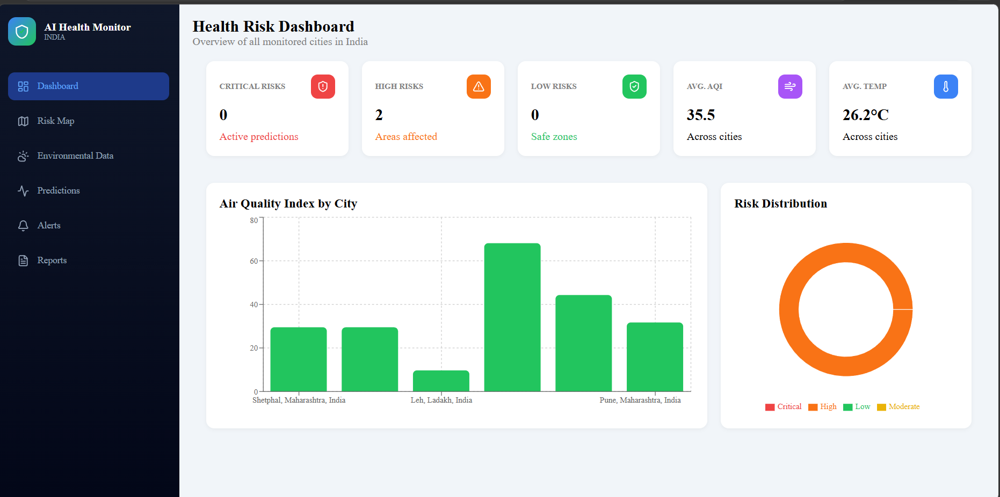
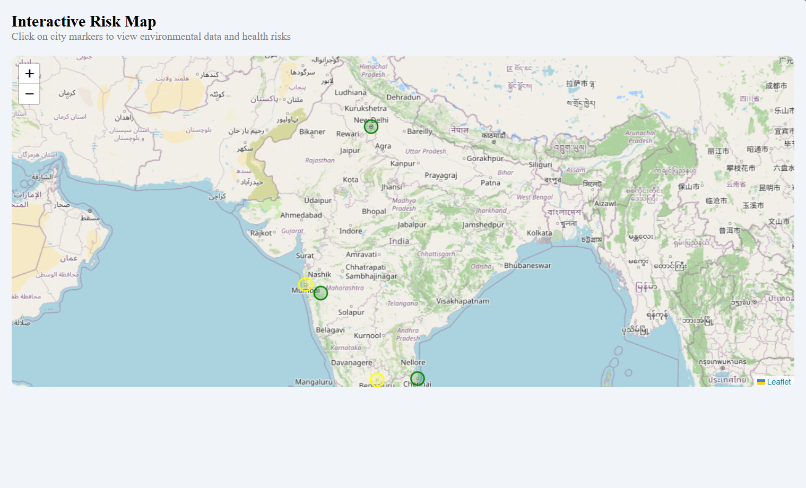
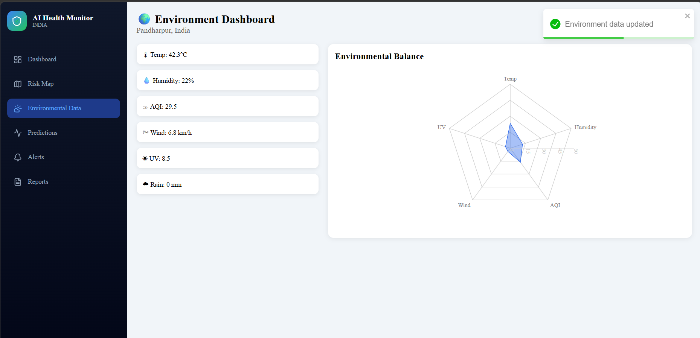
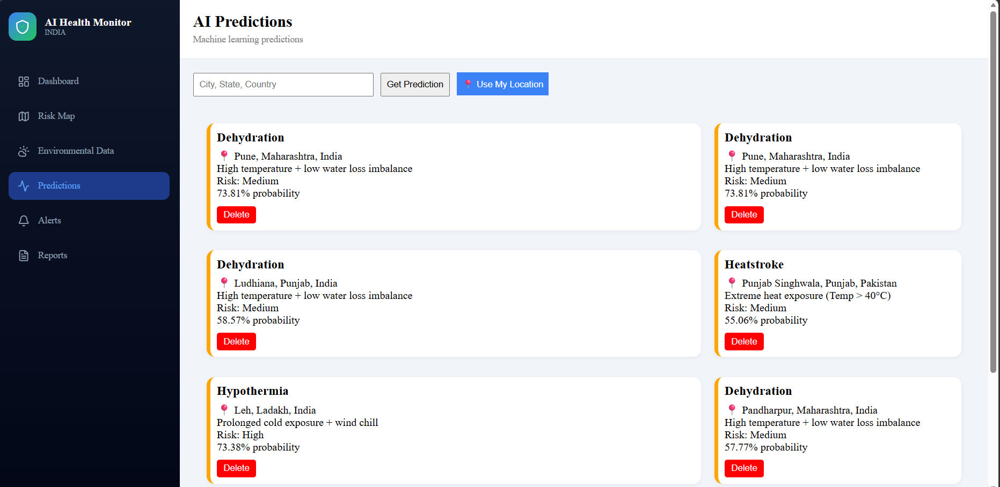
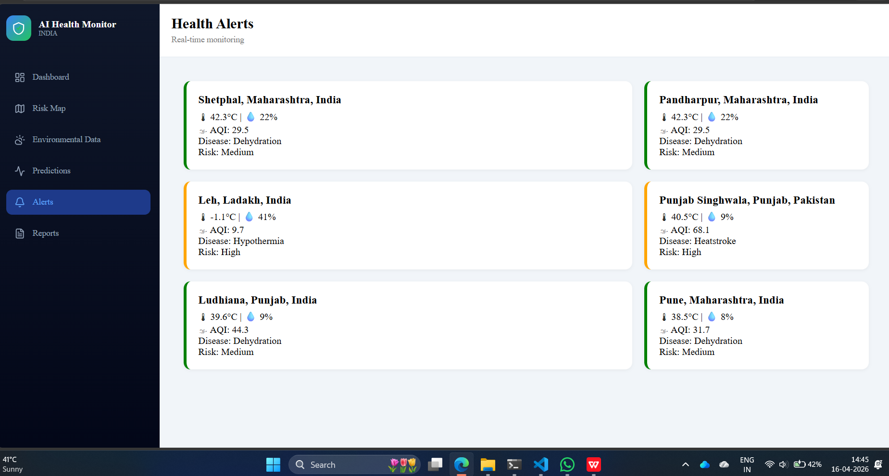
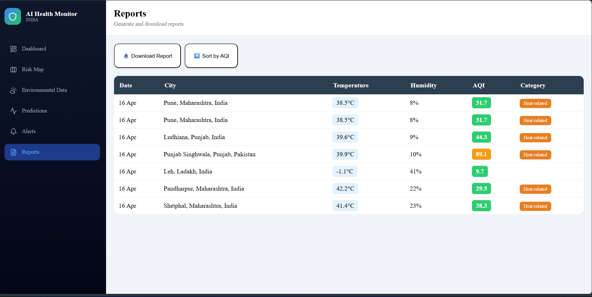
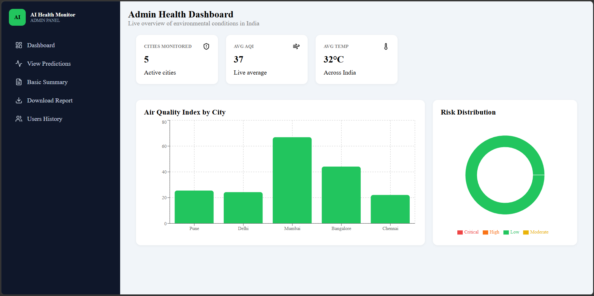
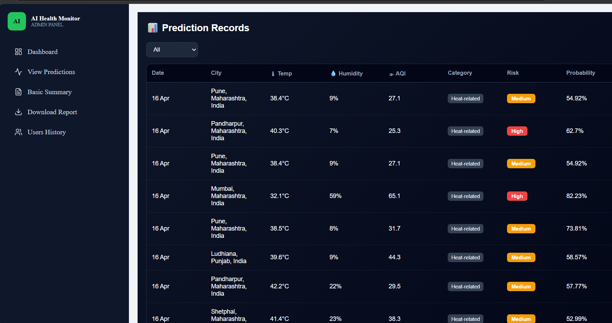
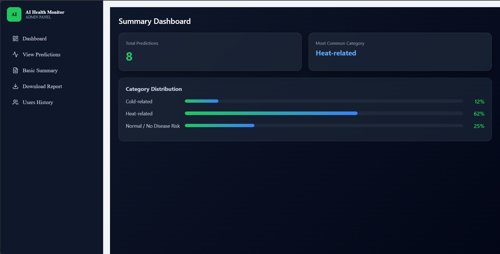
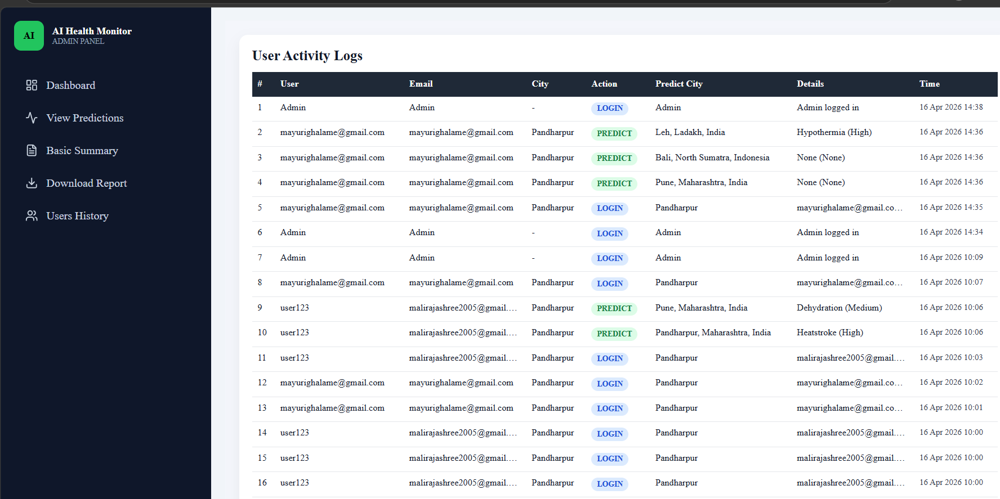

Intelligent Urban Health Risk Prediction System

AI-based system that predicts urban health risks using real-time environmental data and machine learning models.

---

 Problem

Urban health systems are reactive — action is taken only after diseases spread.
This project predicts health risks **before outbreaks happen** using environmental data.

---

 Solution

The system collects real-time data such as:

* Temperature
* Humidity
* Rainfall
* Air Quality Index (AQI)
* UV Index

Machine Learning models analyze this data to:

* Predict health risk levels
* Generate early warnings
* Provide preventive insights

---

Features

* 🌐 Real-time data using APIs
* 🤖 AI-based health risk prediction
* 📊 Interactive dashboard
* ⚡ Early warning system
* 🌍 Works for any city

---

 Working

1. Fetch environmental data via APIs
2. Process and clean data
3. Apply ML model for prediction
4. Generate health risk output
5. Display results on dashboard

---

 AI Model

* Model Type: Machine Learning (Random forest based)
* Input: Weather + AQI data
* Output: Community-level health risk prediction
* Backend: Flask-based API serving ML predictions

---

 Tech Stack

* Frontend: React.js
* Backend: Node.js / Express.js
* AI/ML Backend: Python (Flask)
* Database: MongoDB
* Machine Learning: Scikit-learn, Pandas, NumPy

---

## 🌐 Live Demo

🚀 Deployed App: [https://climate-health-risk-ai.vercel.app ](https://climate-health-risk-ai-tgff.vercel.app/) 
💡 Click above to see real-time health risk predictions
 Screenshots

>

### 📊 Dashboard



### 🌍 Risk Map Visualization



### 🌦️ Weather Data



### 🤖 Prediction Output



### 🚨 Alerts System



### 📈 Reports & Analytics



### 🧑‍💼 Admin Dashboard



### 📊 Results View



### 🗂️ Category Management



### 📜 Logs / Data Records



---

## ▶️ How to Run

### Backend (Flask)

```bash
cd backend
pip install -r requirements.txt
python app.py
```

### Frontend

```bash
cd frontend
npm install
npm start
```

---

## 📈 Use Cases

* Public health planning
* Early disease prevention
* Resource allocation
* Smart city systems

---

## 🌍 Impact

* Helps predict diseases before they spread
* Supports proactive healthcare decisions
* Improves urban health resilience

---

## 🔮 Future Improvements

* Deep learning models
* Mobile app integration
* More accurate predictions

---

## ℹ️ Note

AI prediction is handled using a Flask-based ML model integrated with real-time environmental data.

---

## 👩‍💻 Authors

* Rajashri Mali
* Samruddhi Salunkhe
* Sujata Lokare
* Mayuri Ghalame
